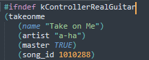
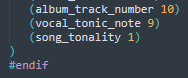

# Rock Band 3 DLC to Rock Band 2

Welcome to the RB3 DLC to RB2 repo. 

It's highly recommended that if installing in bulk, to pack together the songs you want using [Nautilus](https://nemosnautilus.com/nautilus/) or [Onyx](https://github.com/mtolly/onyx/). Note that some of these CONs will be updated over time. 

When adding your chosen songs to a pack, it is also highly recommended to put the following script in the pack's songs.dta so you don't get any duplicate entries in Rock Band 3:
- `#ifndef kControllerRealGuitar` (this goes on the very top of the songs.dta) 

- `#endif` (this goes at the very bottom of the songs.dta) 

## DLC Songs Converted:
* 38 Special - Hold On Loosely
* A Flock of Seagulls - I Ran (So Far Away)
* Aerosmith - Back in the Saddle
* Aerosmith - Sweet Emotion
* a-ha - Take on Me
* Andrew W.K - Party Hard
* Arctic Monkeys - R U Mine?
* Avenged Sevenfold - Shepherd of Fire
* Avenged Sevenfold - Unholy Confessions
* Avenged Sevenfold - Welcome to the Family
* Billy Joel - Piano Man
* Billy Joel - She's Always a Woman
* Black Veil Brides - Rebel Love Song
* Bonnie Tyler - Total Eclipse of the Heart
* Breaking Benjamin - Breath
* Breaking Benjamin - Sooner or Later
* Breaking Benjamin - Until the End
* Bullet For My Valentine - Scream Aim Fire
* Bullet For My Valentine - Tears Don't Fall
* Bullet For My Valentine - Your Betrayal
* Caesars - Jerk It Out
* Cheap Trick - I Want You to Want Me (Live)
* Cheap Trick - Surrender (Live)
* Chumbawamba - Tubthumping
* Cobra Starship (ft. Sabi) - You Make Me Feel...
* David Bowie - Ziggy Stardust
* Def Leppard - Photograph
* Deftones - My Own Summer (Shove It)
* Depeche Mode - Never Let Me Down Again
* Depeche Mode - Personal Jesus
* Depeche Mode - Policy of Truth
* Eddie Money - Two Tickets to Paradise
* Evanescence - Everybody's Fool
* Fall Out Boy - Dance, Dance
* Fall Out Boy - Sugar, We're Goin Down
* Fall Out Boy - Thnks fr th Mmrs
* Good Charlotte - The Anthem
* Green Day - Oh Love
* Hoobastank - Crawling in the Dark
* Incubus - Pardon Me
* Jefferson Airplane - Somebody to Love
* Killswitch Engage - Starting Over
* Killswitch Engage - The Arms of Sorrow
* Killswitch Engage - The End of Heartache
* KISS - Strutter (Live)
* Kool & the Gang - Jungle Boogie
* KoRn - Falling Away from Me
* KoRn - Freak on a Leash
* Lady Gaga - Paparazzi
* Limp Bizkit - Gold Cobra
* Limp Bizkit - My Way
* Limp Bizkit - Nookie
* Limp Bizkit - Re-Arranged
* Linkin Park - Breaking the Habit
* Linkin Park - Burn It Down
* Linkin Park - Crawling
* Linkin Park - In the End
* Linkin Park - New Divide
* Linkin Park - Numb
* Linkin Park - Shadow of the Day
* Linkin Park - Somewhere I Belong
* Linkin Park - Waiting for the End
* Linkin Park - What I've Done
* Live - I Alone
* Live - Lightning Crashes
* Maroon 5 - This Love
* Mastodon - Blood and Thunder
* Megadeth - A Tout le Monde
* Mudvayne - Happy
* My Chemical Romance - Helena
* My Chemical Romance - Sing
* My Chemical Romance - Teenagers
* Nickelback - Animals
* Nickelback - How You Remind Me
* Nickelback - Someday
* Nirvana - All Apologies
* Nirvana - Heart-Shaped Box
* Nirvana - Rape Me
* Nirvana - You Know You're Right
* P.O.D - Boom
* Panic at the Disco - I Write Sins Not Tragedies
* Paramore - Brick by Boring Brick
* Paramore - Ignorance
* Paramore - Pressure
* Paramore - The Only Exception
* P!nk - Get the Party Started
* Poison - Talk Dirty to Me
* Puddle of Mudd - Blurry
* Puddle of Mudd - Control
* Puddle of Mudd - She Hates Me
* Queen - Bicycle Race
* Queen - Don't Stop Me Now
* Queen - Stone Cold Crazy
* Rage Against the Machine - Bombtrack
* Rage Against the Machine - Sleep Now in the Fire
* Red Hot Chili Peppers - By the Way
* Red Hot Chili Peppers - Californication
* Red Hot Chili Peppers - Otherside
* Red Hot Chili Peppers - The Adventures of Rain Dance Maggie
* Rick Springfield - Jessie's Girl
* Rush - Caravan
* Rush - Fly by Night
* Rush - The Spirit of Radio (Live)
* Santana - Black Magic Woman
* Santana - Black Magic Woman/Gypsy Queen (Beta Chart)
* Slayer - Raining Blood
* Slipknot - Left Behind
* Slipknot - Pulse of the Maggots
* Slipknot - Snuff
* Slipknot - Wait and Bleed
* Smash Mouth - Can't Get Enough of You Baby
* Soft Cell - Tainted Love
* Soundgarden - Blow Up the Outside World
* Soundgarden - Burden in My Hand
* Soundgarden - Fell on Black Days
* Soundgarden - Outshined
* Soundgarden - Rusty Cage
* Soundgarden - The Day I Tried to Live
* Staind - It's Been Awhile
* Staind - So Far Away
* Stone Temple Pilots - Big Bang Baby
* Sublime - Santeria
* Sublime - What I Got
* Sublime - Wrong Way
* System of a Down - Aerials
* System of a Down - Hypnotize
* The Darkness - I Believe in a Thing Called Love
* The Edgar Winter Group - Frankenstein
* The Strokes - Under Cover of Darkness
* The Vapors - Turning Japanese
* Three Days Grace - Animal I Have Become
* Three Days Grace - I Hate Everything About You
* Three Days Grace - Pain
* Three Days Grace - The Good Life
* Toadies - Away
* Toadies - Possum Kingdom
* Toadies - Tyler
* Weezer - Back To The Shack
* Weezer - Hash Pipe
* Weezer - Island in the Sun
* Yellowcard - Only One

## RBN 2.0 Songs Completed:
* A Day to Remember - 2nd Sucks
* A Day to Remember - All Signs Point to Lauderdale
* A Day to Remember - Better Off This Way
* A Day to Remember - If It Means a Lot to You
* A Day to Remember - Sticks & Bricks
* A Day to Remember - The Plot to Bomb the Panhandle
* Asking Alexandria - Dear Insanity
* Asking Alexandria - Morte et Dabo
* Asking Alexandria - Reckless & Relentless
* Asking Alexandria - To the Stage
* Black Veil Brides - Children Surrender
* Black Veil Brides - Heaven's Calling
* Black Veil Brides - Perfect Weapon
* Blessthefall - What's Left Of Me
* Bring Me The Horizon - Pray for Plagues
* Chiodos - Caves
* I See Stars - Filth Friends Unite
* Jonathan Coulton - Alone at Home
* Jonathan Coulton - Good Morning Tucson
* Jonathan Coulton - Nemeses (ft. John Roderick)
* Jonathan Coulton - Still Alive (ft. Sara Quin)
* Jonathan Coulton - The Stache
* Mastodon - Megalodon
* No Bragging Rights - Death of an Era
* Pierce the Veil - Caraphernelia
* Prototype - The Way It Ends
* Psychostick - BEER!
* Silverstein - Burning Hearts
* Sleeping with Sirens - If You Can't Hang
* Toby Turner - I Can Swing My Sword (ft. Terabite)

## Converts done by:
*  Anthoalreadypopped, AnxiousQT, C0Assassin, D-97, Underoath628
